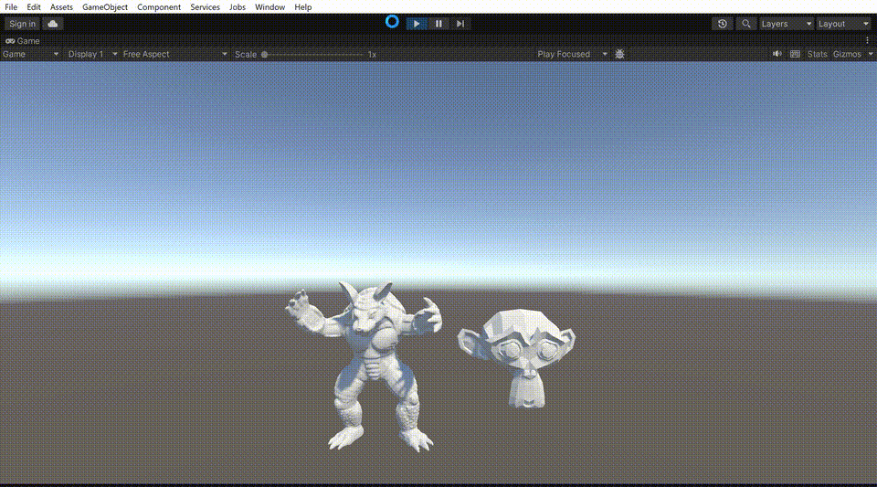

# PBD_Fluid_Demo_Unity

PBD Fluid Demo in Unity, contains surface tension, vorticity confinement, one-way coupling with rigid body and screen space fluid rendering. Based on [Scrawk's Unity PBD Fluid](https://github.com/Scrawk/PBD-Fluid-in-Unity), [BRONSON ZGEB's GPU based mesh voxelization](https://github.com/bzgeb/UnityGPUMeshVoxelizerPart3) and [Screen Space Fluid Rendering in GDC2010](https://developer.download.nvidia.cn/presentations/2010/gdc/Direct3D_Effects.pdf)

